# Problem Statement
>You have a function that generates a number between 0 to 1 randomly which is uniformly distributed. Now calculate the number pi.

# Solution Explanation

So the basic idea is to randomly draw a point in a 1 to 1 square since you can call the ```random.uniform(0, 1)``` function twice *(Done in the Python/CalculatePi.py on line number: 9 and 10)*, it will generate 2 numbers between 0 to 1. Let's use one from the x-axis and one for the y-axis. 

Let take an example if the 2 randomly generated numbers are  **x = 0.2** and **y = 0.6**, then we are going to get somewhere point like this.


So, let me randomly draw some more points then it will look like


After drawing a square and circle through it, it will look like: 

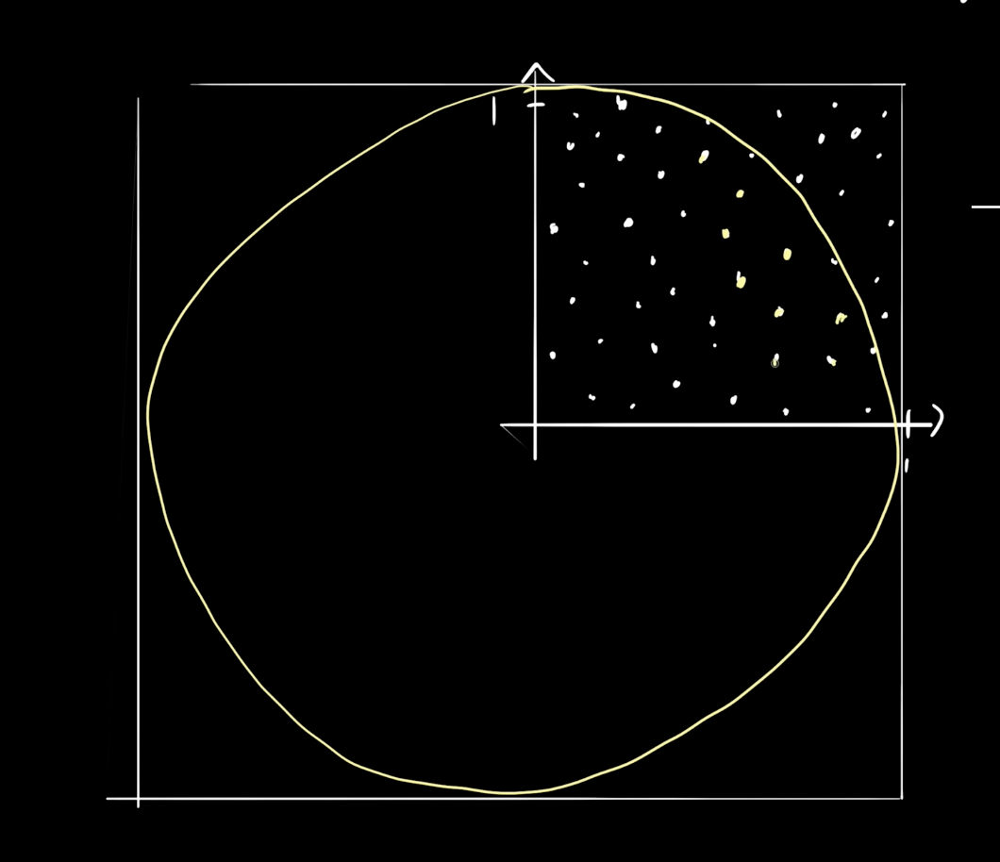

As you can see now, the goal here is to calculate all the points inside the circle and calculate all the points inside the square.

>**Points inside the circle**

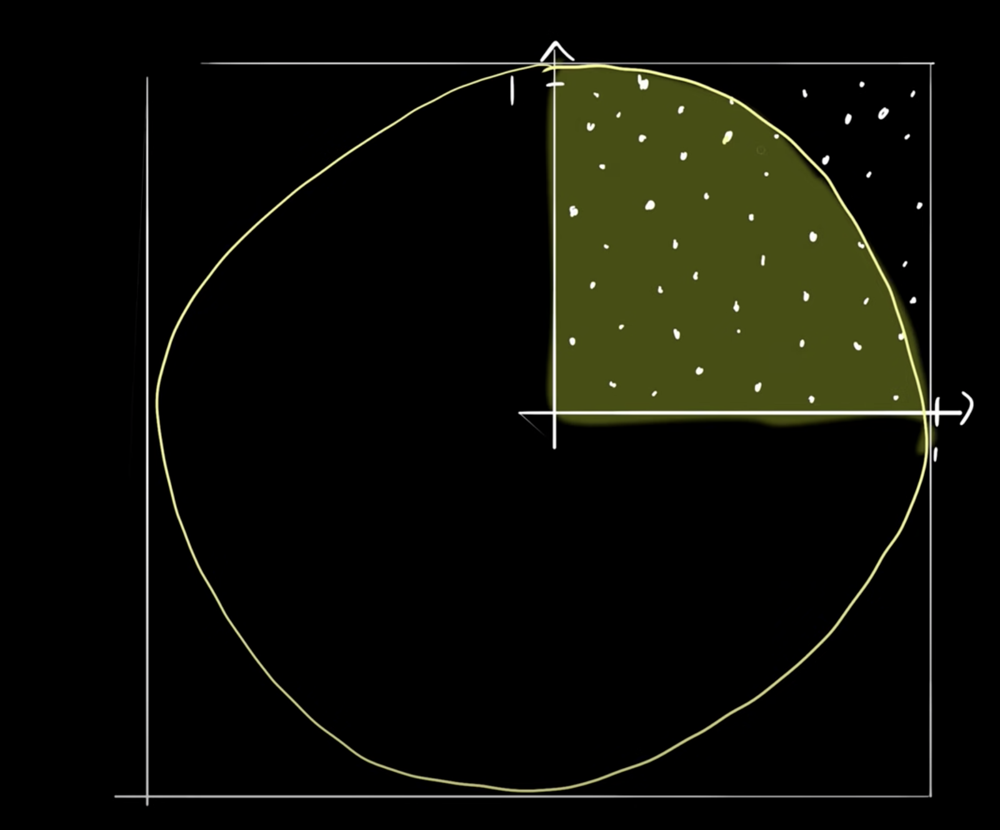

>**Points inside the square**

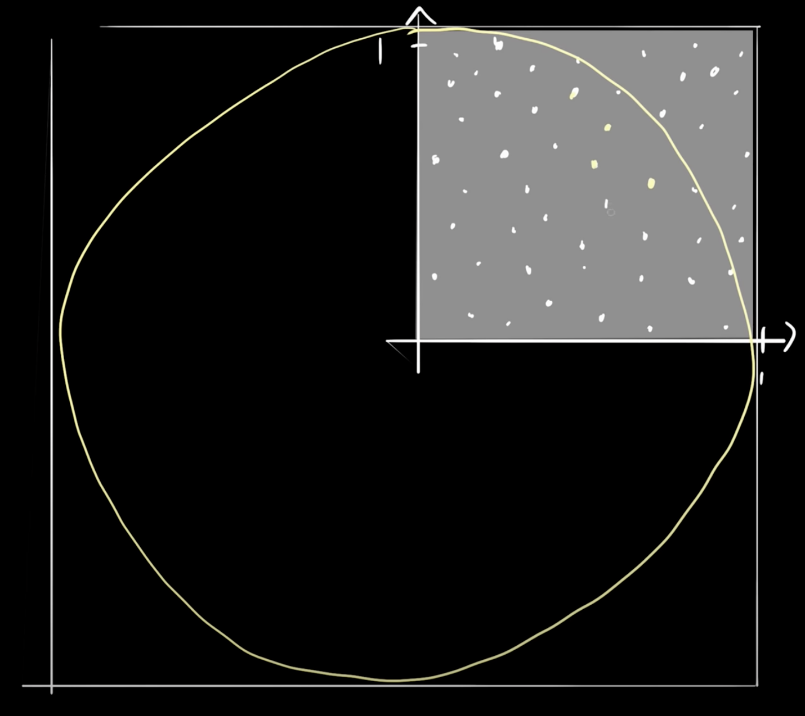

The ratio between the number of points inside the circle and the number of points inside the square will be pretty closed to the ratio between the total area of a circle and the total area of this square.

>**The total area of the circle**

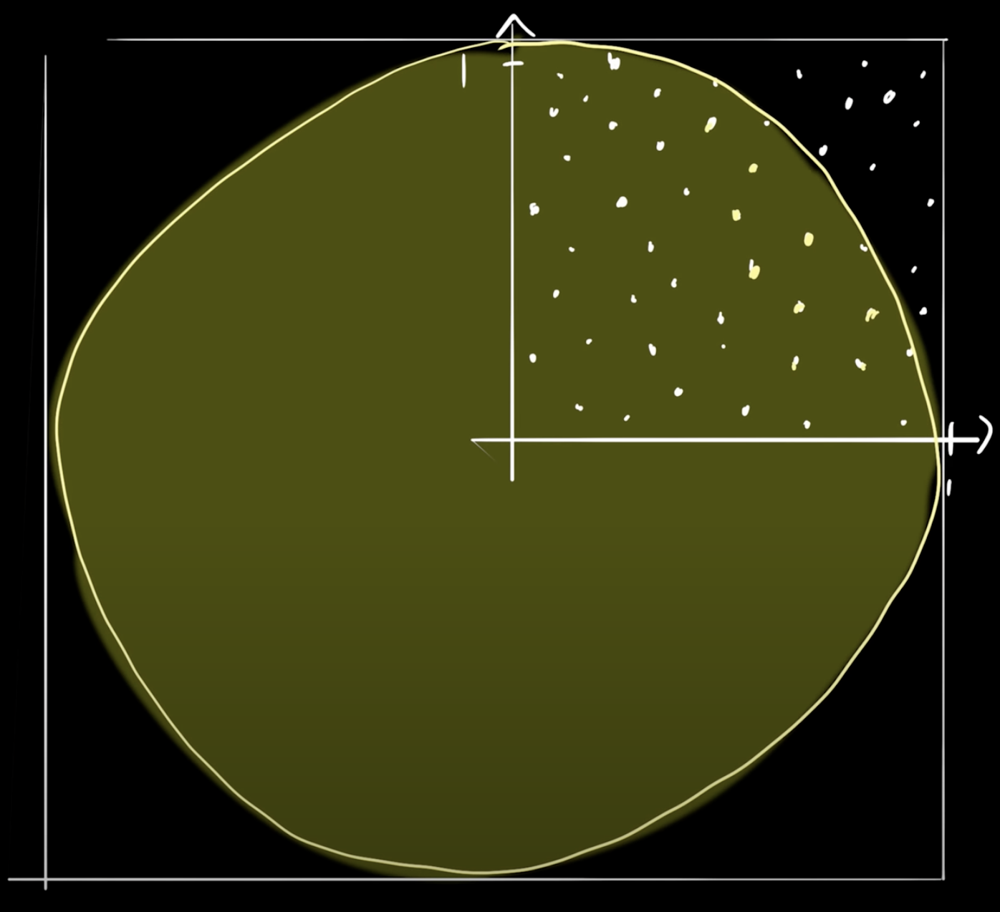

>**The total area of the square**

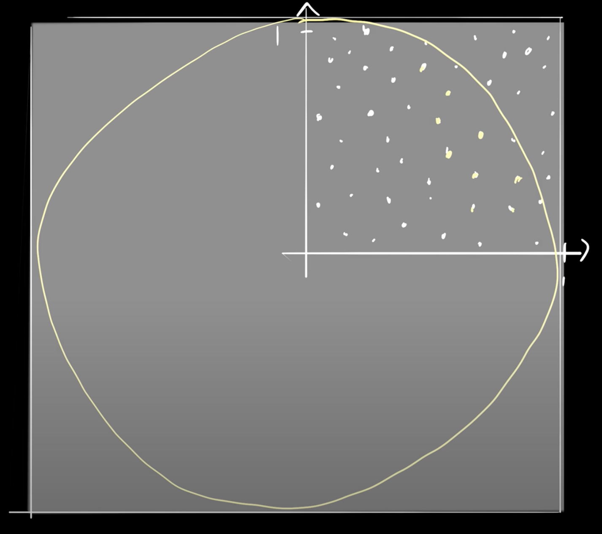

>**Equalling the ratios will be like:**

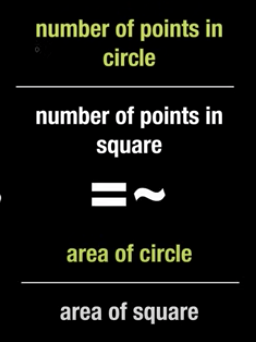

So, how do you know that the point lies inside the circle? Well, it is pretty simple, you just take the distance between the point to the **origin** and if it is smaller than or equal to 1 then the point will be inside the circle.

>**For Example let takes this one**

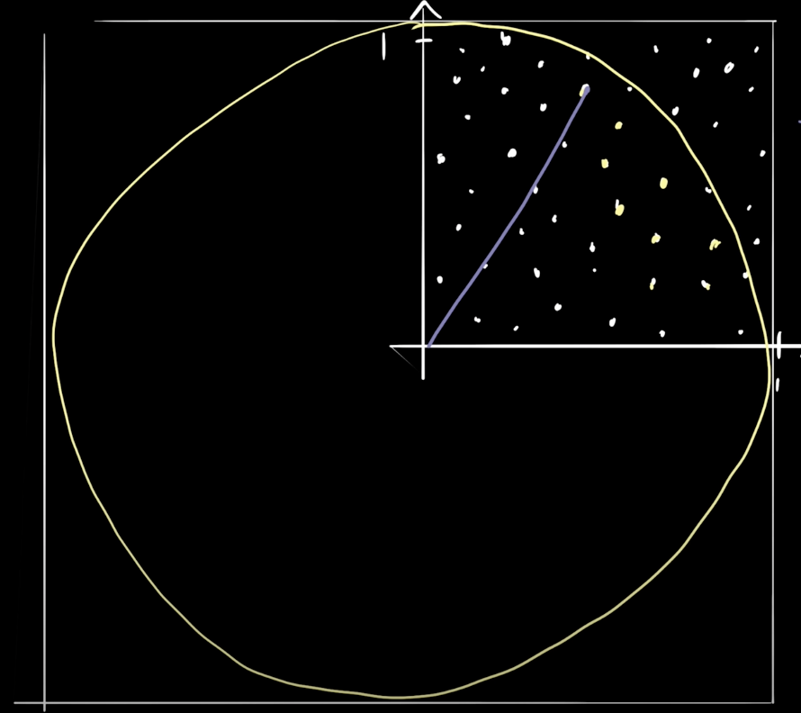

So the distance is basically will the  
```
squareRoot = sqrt(x^2 + y^2)
```

if ```squareRoot``` is smaller than one then the point lies inside the circle and if it is larger than one then the point lies outside the circle but still will be inside the square.

>Now the basic algebra will work

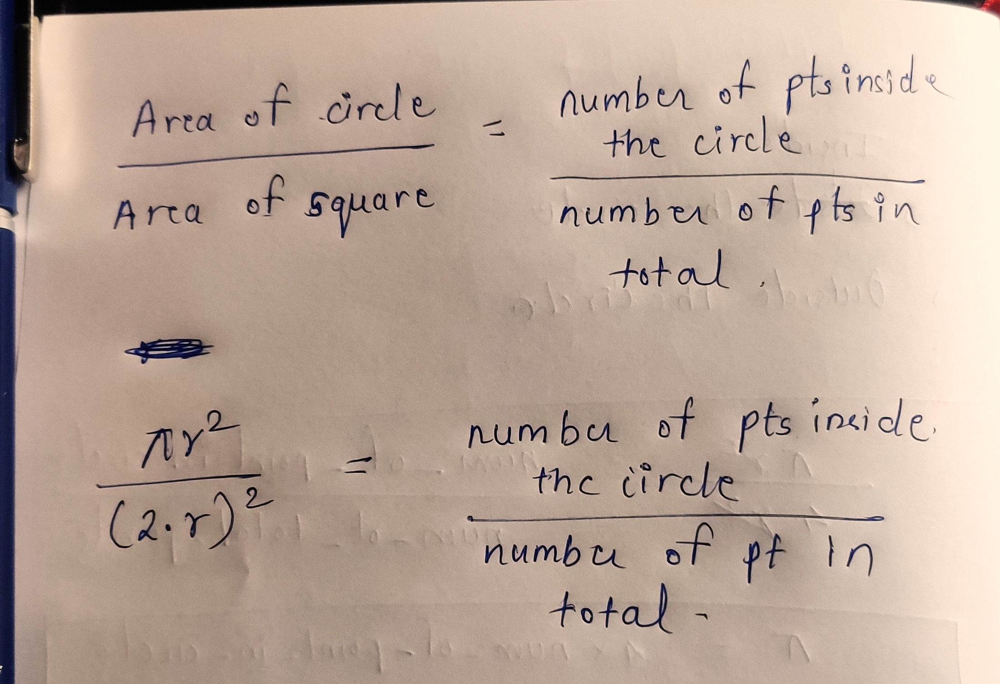
```
As the radius is 1
```
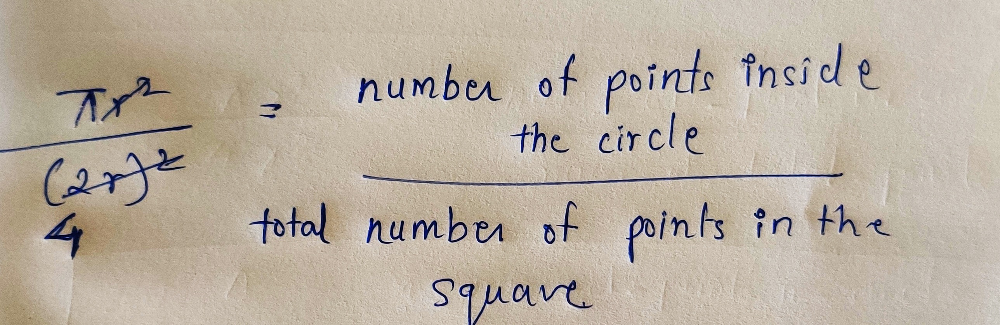
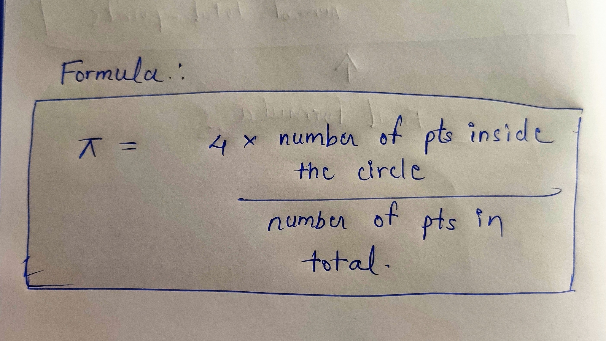

I got the more accurate value of pi for n = 100000000. As it uses the ```random.uniform()``` method, the answer you will get will be different.

```
n = 100000000
```
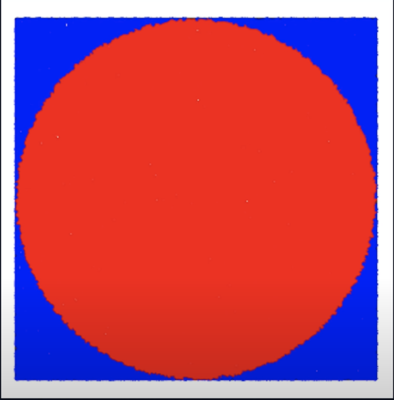