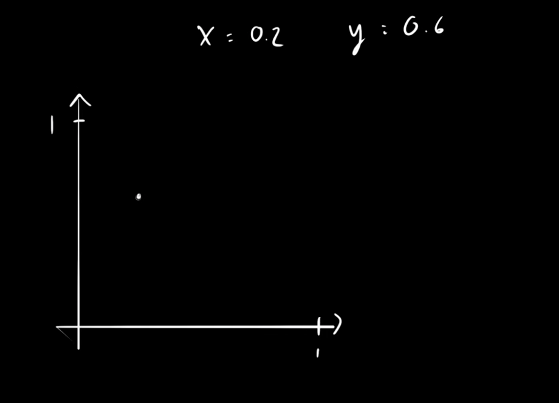

# Problem Statement
>You have a function that generate a number between 0 to 1 randomly which is uniformly distributed. Now calculate the number pi.

# Solution Explaination

So the basic idea is to randomly draw a point in a 1 to 1 square, since you can call the ```random.uniform(0, 1)``` function twice *(Done in the Python/CalculatePi.py on line number : 9 and 10)*, it will generate 2 number between 0 to 1. Let's use them one from the x axis and one for y axis. 

Let take an example of **x = 0.2** and **y = 0.6**, then we are gonna get somewhere the point like here.




So, let me randomly draw some more point then it will be look like


Now let me draw a sqaure and circle through it.


As you can see now, the goal hear is to calculate all the point inside the circle


and calculate all the point inside the sqaure.


The ratio between the number of points inside the circle and number of points inside the square will be preety closed to ratio between the total area of circle and total area of this sqaure.

>**The total area of the circle**


>**The total area of the sqaure**


>**Eqaulling the ratios will be like :**


So, how do you know that the point lays inside the circle. Well it preety simple, you just take the distance between the point to the origin and if it is smaller than 1 than the point will be inside the circle.

>**For Example let takes this one**


So the distance is basically \sqrt{x^2 + y^2} 