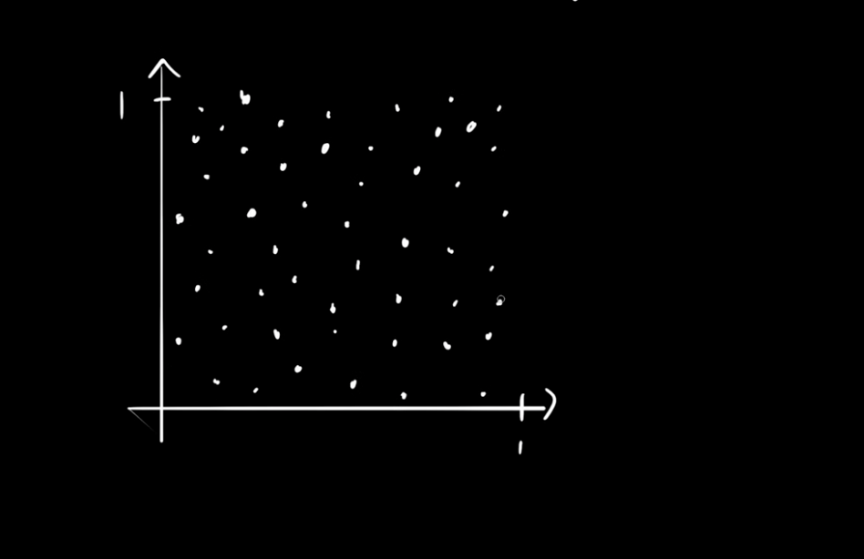

# Problem Statement
>**You have a function that generates a number between 0 to 1 randomly which is uniformly distributed. Now calculate the number pi.**

# Solution Explanation

So the basic idea is to randomly draw a point in a 1 to 1 square since you can call the ```random.uniform(0, 1)``` function twice it will generate 2 numbers between 0 to 1. Let's use one from the x-axis and one for the y-axis. 

Lets take an example if the 2 randomly generated numbers are  **x = 0.2** and **y = 0.6**, then we are going to get point somewhere like this.


So, let me randomly draw some more points then it will look like



**The tricky part and the Hint:** The only way to find the value of pi is with the help of circle and square and their area's. So let me draw a circle and square through it. 


As you can see now, the goal here is to calculate all the points inside the circle and calculate all the points inside the square.

>**Points inside the circle**


>**Points inside the square**


The ratio between the number of points inside the circle and the number of points inside the square will be pretty closed to the ratio between the total area of a circle and the total area of this square.

>**The total area of the circle**


>**The total area of the square**


>**Equalling the ratios will be like:**


So, how do you know that the point lies inside the circle? Well, it is pretty simple, you just take the distance between any random point to the **origin** and if it is smaller than or equal to 1 then the point will lie inside the circle.

>**For Example let takes this one**


So the distance will be 
```
squareRoot = sqrt(x^2 + y^2)
```

if ```squareRoot``` is smaller than one then the point lies inside the circle and if it is larger than one then the point lies outside the circle but still will be inside the square.

>Now the basic algebra will work


```
As the radius is 1
```


I got the more accurate value of pi for n = 100000000. As it uses the ```random.uniform(0, 1)``` method, the answer you get will be different.

```
n = 100000000
pi = 3.1415
```


>**Guide to contribute is in Contribute file. Here is the link
[contribute](./Contribute.md)**